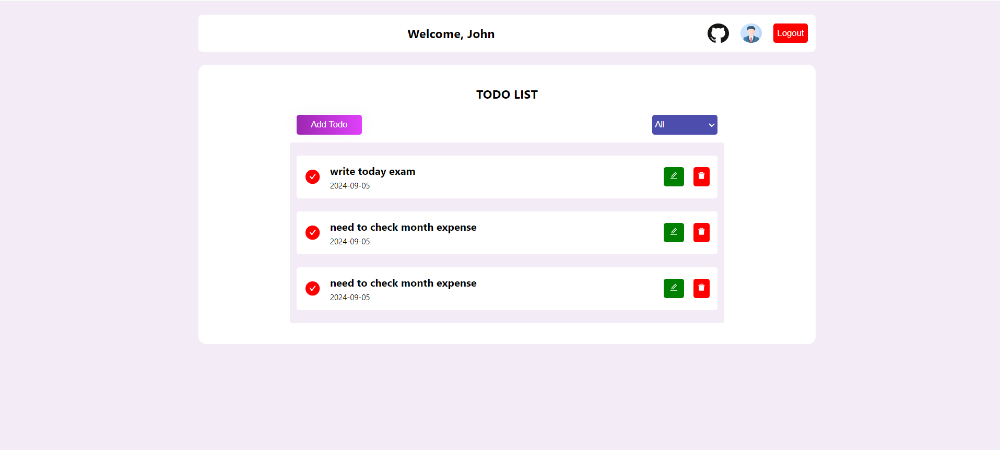

# User Management App with Todo List and Profile Editing.

This project is a basic user management application built with React, Hooks, and Redux. The app allows users to log in, view and edit their profiles, manage their to-do tasks, and log out.

**live demo: [https://todomanagementapp22.netlify.app/](https://todomanagementapp22.netlify.app/)**

# User Details

- `User name` : admin
- `Password` : password

# Features

- `Login System`: Users can log in with a hardcoded username and password. Upon successful login, the user is redirected to the dashboard.
- `Profile Management`: Users can view and edit their profile details like username and email.
- `To-Do List`: Users can create, edit, delete, and filter their tasks.
- `Logout`: Users can log out, which clears their session and redirects them to the login page.
- `Responsive UI`: The app features a clean and responsive UI.

## Technologies Used

- React: Functional components with hooks (useState, useEffect)
- Redux: Global state management for user authentication, profile, and tasks
- React Router: For routing between different pages (Login, Dashboard, Profile, and To-Do list)
- CSS: For basic styling

## Prerequisites

Ensure you have the following installed:

- Node.js (v14 or later)
- npm (v6 or later)
- Installation

1. Clone the repository:

```shell
   git clone https://github.com/HariKrishnan2k18/User-Management.git
```

2. Navigate to the project directory:

```shell
   cd user-management-app
```

3. Install dependencies:

```shell
   npm install
```

## Running the App

To start the app locally, run:

```shell
npm start
```

## Folder Structure

`src/`: Contains the source code

- `components/`: Reusable components like login, profile, todo list
- `redux/`: State management files (actions, reducers)
- `App.js`: Main app component
- `index.js`: Entry point for the app

## Requirements

- Basic ReactJs knowledge
- Basic HTML, CSS knowledge

Happy Coding! 🚀
